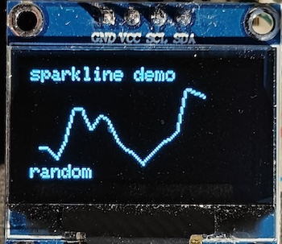

# Sparkline

A library to draw sparklines on Raspberry Pi Pico making use of the C/C++ SDK. The project works with a 128x64 OLED display with the help of an existing library ([daschr/pico-ssd1306](https://github.com/daschr/pico-ssd1306)).

Sparklines are typically compact and simplified line charts that show the trend of some measurement over time. They often leave out axes, labels, and other elements often found on charts to maximize the data-to-ink ratio.

## How to use

Include `sparkline.c` and its header file in your project.

Create a `struct` of `sparkline_t` with the configuration needed. Set the coordinates, the area dimensions, and the step size of (amount of pixels between) each point.

1. Reset the chart with `sparkline_clear`
1. Call `sparkline_add_datapoint` for each of your values (array of `int16_t`, oldest first)
1. Finally, call `sparkline_draw` which draws the entire line

On screen, the most recent point touches the right edge of the area, and the rest of the line advance to the left. Any excess points are silently dropped.

The set of values is automatically normalized to the height of the area with the min/max value touching the bottom/top of the area.

For more information, see `sparkline_t` [sparkline.h](sparkline.h#L12)

## Running the demo

The demo's display is set up with GPIOs 18 (SDA) and 19 (SCL). For a quick test you can try dropping in ``sparkline.uf2`` (located at repository root) after hooking up the display.

To build the demo you can clone the project and make sure the submodule is fetched as well.

    git clone --recurse-submodules <this project's GitHub URL>

# License

MIT License
